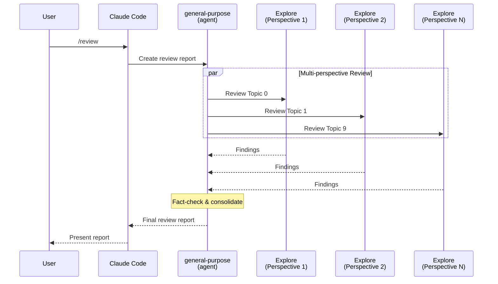

* Invoke @"general-purpose (agent)" subagent to create a review report by
    * orchestrate 10 @general-purpose subagents asking for strict multi-perspective review
    * fact check the review result and create a final report

