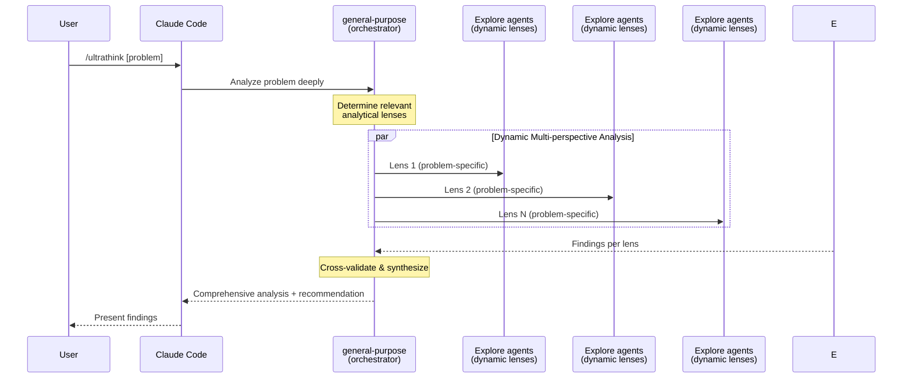

Invoke @"general-purpose (agent)" subagent to perform deep multi-perspective analysis by:

1. **Analyzing the problem** to determine 3-5 relevant analytical lenses
   - Consider: What perspectives would reveal blind spots in this specific problem?
   - Examples of possible lenses (choose what fits):
     - Feasibility, Alternatives, Risks, Implications
     - Security, Performance, Maintainability
     - User impact, Cost, Timeline
     - Historical context, Industry patterns
     - Constraints, Dependencies, Edge cases

2. **Orchestrating parallel @"Explore (agent)" subagents** for each chosen lens
   - Each agent explores the problem through its assigned perspective
   - Agents work independently and in parallel

3. **Synthesizing findings** into a structured analysis:
   - Cross-validate claims between perspectives
   - Identify consensus and conflicts
   - Highlight critical unknowns requiring further investigation

4. **Producing a final recommendation** with:
   - Clear rationale backed by evidence from exploration
   - Explicit trade-offs acknowledged
   - Concrete next steps

